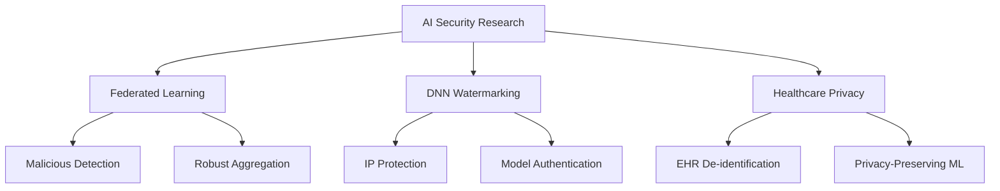

# Hi there! 👋 I'm Reda Bellafqira

**👨‍🏫 Associate Professor | 🔬 Researcher | 🛡️ Cybersecurity Expert | 🤖 AI/ML Enthusiast**

Welcome to my GitHub profile! I'm an Associate Professor at IMT Atlantique, specializing in **federated learning**, **deep neural network watermarking**, and **privacy-preserving machine learning**. My work focuses on developing secure and robust AI systems, particularly in sensitive domains like healthcare.

---
## 🚀 About Me

- 👨‍🏫 **Position**: Associate Professor at IMT Atlantique
- 🔬 **Research Focus**: Federated Learning, AI Security, Healthcare Data Privacy
- 📚 **Teaching**: C++ Programming, Cryptography, Network Security
- 🏛️ **Institution**: IMT Atlantique, France
- 📧 **Contact**: reda.bellafqira@imt-atlantique.fr
- 🌍 **Based in**: France
- 📊 **Publications**: 29+ research papers with 139+ citations

## 🔬 Research Interests

```python
research_areas = {
    "AI Security": ["Deep Neural Network Watermarking", "Malicious Model Detection"],
    "Privacy Tech": ["Federated Learning", "Healthcare Data De-identification"],
    "Applications": ["Electronic Health Records", "Medical AI", "Privacy-Preserving ML"],
    "Security": ["Cryptography", "Data Protection", "Blockchain"]
}

teaching_areas = {
    "Programming": ["C++ Development", "Algorithm Design", "Design patterns"],
    "Security": ["Applied Cryptography"],
}
```

## 🎓 Teaching & Education

As an Associate Professor at IMT Atlantique, I'm passionate about education and mentoring the next generation of cybersecurity and AI professionals:

**📚 Courses I Teach:**
- **C++ Programming** - Advanced programming concepts, data structures, and algorithms
- **Cryptography** - Classical and modern cryptographic techniques, security protocols

**🎯 Research Supervision:**
- PhD students in AI Security and Federated Learning
- Master's thesis projects in privacy-preserving machine learning
- International collaborations and research exchanges

---

### 🔐 [DICTION](https://github.com/Bellafqira/DICTION) - DNN Watermarking
**Dynamic Robust White-box Watermarking Scheme**
- 🎯 Protecting intellectual property of deep neural networks
- 🛡️ Robust against various attacks and model modifications
- 📄 [Research Paper](https://arxiv.org/abs/2210.15745) (arXiv:2210.15745)

### 🔍 [FedCAM](https://github.com/Bellafqira/FedCAM_) - Malicious Model Detection
**Identifying Malicious Models in Federated Learning**
- 🕵️ Detects malicious participants in federated learning environments
- 🧠 Uses activation maps for conditional identification
- 🏥 Applications in healthcare and sensitive domains

### 📊 [Histogram Shifting Predictions](https://github.com/Bellafqira/histogram_shiffting_predictions)
**Advanced Data Analysis Techniques**
- 📈 Statistical analysis and prediction methods
- 🔬 Research-grade implementation
- 📊 Data visualization and processing tools

## 📚 Recent Publications

**Selected Recent Work:**
- 🏥 **"Secure Extraction of Personal Information from EHR by Federated Machine Learning"** - Privacy-preserving healthcare AI
- 🔒 **"FedCAM - Identifying Malicious Models in Federated Learning Environments"** - Security in distributed learning
- 📋 **"Automatic de-identification of French Electronic Health Records"** - Healthcare data privacy
- 🌐 **"When Federated Learning Meets Watermarking"** - Comprehensive overview of IP protection

[📖 View Full Publication List](https://scholar.google.fr/citations?user=CueXGB8AAAAJ&hl=fr)

## 🛠️ Technical Skills

<div align="center">

**Languages & Frameworks**
</div>


<div align="center">

**Research & Security**
</div>


## 📊 GitHub Statistics

<div align="center">
  
  
</div>

<div align="center">
  
</div>

## 🌟 Research Impact

```
📊 Research Metrics:
├── 📄 Publications: 29+
├── 📈 Citations: 139+
├── 🔗 H-index: Growing
└── 🌍 International Collaborations
```

## 🤝 Collaboration & Contact

I'm always interested in collaborating on:
- 🔬 **Federated Learning** research and applications
- 🛡️ **AI Security** and robustness studies  
- 🏥 **Healthcare AI** and privacy-preserving technologies
- 📚 **Open Source** projects in ML security

**Let's Connect:**
- 📧 Email: [reda.bellafqira@imt-atlantique.fr](mailto:reda.bellafqira@imt-atlantique.fr)
- 🔗 Google Scholar: [My Publications](https://scholar.google.fr/citations?user=CueXGB8AAAAJ&hl=fr)
- 🌐 ResearchGate: [My Profile](https://www.researchgate.net/profile/Reda-Bellafqira)

## 🎯 Current Research Focus



---

<div align="center">

**"Advancing AI security and privacy through innovative research and open collaboration"**

⭐ *If you find my work interesting, feel free to star my repositories!* ⭐

</div>
