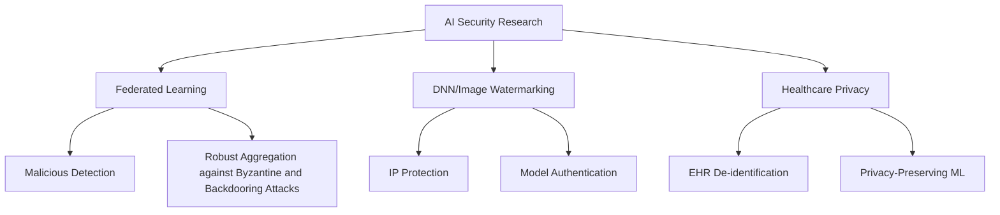

# Hi there! 👋 I'm Reda Bellafqira

**👨‍🏫 Associate Professor | 🔬 AI Security Researcher | 🤖 AI/ML Enthusiast**

Welcome to my GitHub profile! I'm an Associate Professor at IMT Atlantique, specializing in **federated learning**, **deep neural network watermarking**, and **cryptography**. My work focuses on developing secure and robust AI systems, particularly in sensitive domains like healthcare.

---

## 🚀 About Me

- 👨‍🏫 **Position**: Associate Professor at IMT Atlantique
- 🔬 **Research Focus**: Federated Learning, DNN Watermarking, AI Security, Healthcare Data Privacy
- 📚 **Teaching**: C++ Programming, Cryptography
- 🏛️ **Institution**: IMT Atlantique, France
- 📧 **Contact**: reda.bellafqira@imt-atlantique.fr
- 🌍 **Based in**: France
- 📊 **Publications**: 35+ research papers with 239+ citations

## 🔬 Research Interests

```
🔬 Research Areas:
├── AI Security
│   ├── Deep Neural Network Watermarking
│   └── Malicious Model Detection
├── Privacy Tech
│   ├── Federated Learning
│   └── Healthcare Data De-identification
├── Applications
│   └── Medical AI
└── Security
    ├── Cryptography
    ├── Watermarking
    └── Blockchain

📚 Teaching Areas:
├── Programming
│   ├── C++ Development
│   ├── Design Patterns
│   └── UML Diagrams
└── Security
    └── Applied Cryptography
```

## 🎓 Teaching & Education

As an Associate Professor at IMT Atlantique, I'm passionate about education and mentoring the next generation of cybersecurity and AI professionals:

**📚 Courses I Teach:**
- **C++ Programming** - Advanced programming concepts, data structures, and algorithms
- **Cryptography** - Classical and modern cryptographic techniques, security protocols

**🎯 Research Supervision:**
- PhD students and research engineers in AI Security, Federated Learning, Homomorphic Encryption, Secure Multiparty Computation, Image watermarking
- Master's thesis projects in privacy-preserving machine learning
- International collaborations and research exchanges

---

## 🔬 Featured Research Projects

### 🔐 [DICTION](https://github.com/Bellafqira/DICTION) - DNN Watermarking
**DICTION: DynamIC robusT whIte bOx Watermarking Scheme for Deep Neural Networks**
- 🎯 Protecting intellectual property of deep neural networks in white-box settings
- 🛡️ Robust against various attacks and model modifications
- 📄 [Research Paper](https://www.mdpi.com/2076-3417/15/13/7511)

### 🔍 [FedCAM](https://github.com/Bellafqira/FedCAM_) - Malicious Model Detection
**FedCAM: Identifying Malicious Models in Federated Learning Environments Conditionally to Their Activation Maps**
- 🕵️ Detects malicious participants in federated learning environments
- 🧠 Uses activation maps for conditional identification to detect Byzantine and backdooring attacks
- 🏥 Applications in healthcare and sensitive domains
- 📄 [Research Paper](https://ieeexplore.ieee.org/document/10449550?signout=success) 

### 📊 [Histogram Shifting Predictions](https://github.com/Bellafqira/histogram_shiffting_predictions)
**A Blockchain-Enhanced Reversible Watermarking Framework for End-to-End Data Traceability in Federated Learning Systems**
- 📈 Statistical analysis and prediction methods
- 🔬 Research-grade implementation
- 📊 Data visualization and processing tools
- 📄 [Research Paper](https://hal.science/hal-05094859v1/file/IP040_CSP2025.pdf) 

## 📚 Recent Publications

**Selected Recent Work:**
- **"DICTION: DynamIC robusT whIte bOx Watermarking Scheme for Deep Neural Networks"**
- **"FedCAM: Identifying Malicious Models in Federated Learning Environments Conditionally to Their Activation Maps"** 
- **"Automatic Deidentification of French Electronic Health Records: A Cost-Effective Approach Exploiting Distant Supervision and Deep Learning Models"** 
- **"When Federated Learning Meets Watermarking: A Comprehensive Overview of Techniques for Intellectual Property Protection"**
- **"A Blockchain-Enhanced Reversible Watermarking Framework for End-to-End Data Traceability in Federated Learning Systems"**
- **"Secure Extraction of Personal Information from EHR by Federated Machine Learning"**
- **"FedCrypt: A Dynamic White-Box Watermarking Scheme for Homomorphic Federated Learning"**

[📖 View Full Publication List](https://scholar.google.fr/citations?user=CueXGB8AAAAJ&hl=fr)

## 🛠️ Technical Skills

<div align="center">

**Languages & Frameworks**
</div>


<div align="center">

**Research & Security**
</div>


## 📊 GitHub Statistics

<div align="center">
  
  
</div>

<div align="center">
  
</div>

## 🌟 Research Impact

```
📊 Research Metrics:
├── 📄 Publications: 35+
├── 📈 Citations: 239+
├── 🔗 H-index: Growing
└── 🌍 International Collaborations
```

## 🎯 Current Research Focus



## 🤝 Collaboration & Contact

I'm always interested in collaborating on:
- 🔬 **Federated Learning** research and applications
- 🛡️ **DNN watermarking** and robustness studies  
- 🏥 **Healthcare AI** and privacy-preserving technologies
- 📚 **Open Source** projects in ML security

**Let's Connect: 🤝**
- 📧 Email: [reda.bellafqira@imt-atlantique.fr](mailto:reda.bellafqira@imt-atlantique.fr)
- 🔗 Google Scholar: [My Publications](https://scholar.google.fr/citations?user=CueXGB8AAAAJ&hl=fr)
- 🌐 ResearchGate: [My Profile](https://www.researchgate.net/profile/Reda-Bellafqira)

---

<div align="center">

**"Advancing AI security and privacy through innovative research and open collaboration"**

⭐ *If you find my work interesting, feel free to star my repositories!* ⭐

</div>
